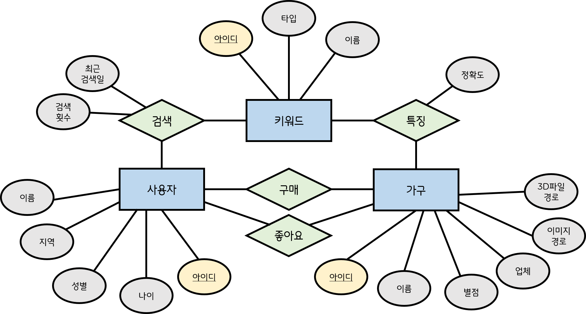
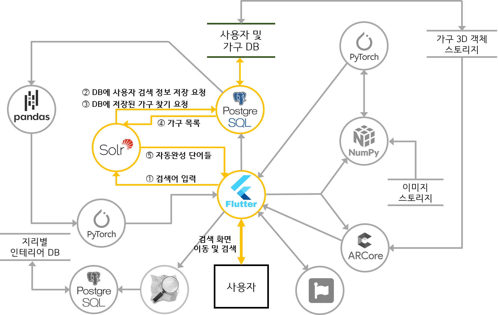

# OS Final Report

Date Created: November 21, 2022 4:21 PM
Status: 진행 중

# 오픈소스 최종 보고서

# 4. 데이터 구조

### 4.1. 데이터베이스

* 사용자 및 가구 데이터베이스 - 사용자 및 가구의 정보를 저장하기 위한 데이터베이스로 가구의 상세 정보만 표시하는것 뿐만 아니라 사용자 추천에도 필요한 정보를 제공

  

  * 사용자 테이블
    * 사용자의 기본 정보가 담긴 테이블로 나이, 성별, 지역 등의 정보가 저장
  * 키워드 테이블
    * 가구에 대한 키워드 정보를 저장한 테이블
    * 타입 : 이 키워드가 무엇을 나타내는 것인지 저장하는 컬럼으로 재질, 색상, 장소, 분류 등이 있음
    * 이름 : 타입에 맞는 특성을 저장하는 컬럼으로 예를들어 유리, 베이지, 욕실, 침대 등이 있음
  * 가구 테이블
    * 가구의 기본 정보가 담긴 테이블로 이름, 사용자 평점, 업체, 이미지 경로, 3D 파일 경로 등이 저장됨
    * 이미지 및 3D파일은 스토리지의 경로를 참조하여 사용
  * 검색 테이블
    * 사용자가 키워드를 검색한다는 의미에서 생겨난 관계집합으로 다대다 관계
    * 사용자가 특정 키워드에 대한 검색한 정보를 저장하는 테이블로 최근 검색일과 검색 횟수가 저장됨
    * 사용자 추천 데이터로 제공
  * 특징 테이블
    * 가구가 특정 키워드에 해당하는 특징을 가진다는 의미에서 생겨난 관계집합으로 다대다 관계
    * 하나의 가구는 여러개의 특징을 가짐 : 베이지색 목재 침대, 검정색 가죽 소파 등
    * 정확도 :  해당 키워드가 가구에게 얼마나 적합한지 나타내는 컬럼
  * 구매 및 좋아요 테이블
    * 사용자가 구매했거나 좋아요한 가구의 관계가 저장

* 지리별 인테리어 데이터베이스 - 사용자의 위치와 지리별 인테리어를 저장하기 위한 데이터베이스로 사용자 위치를 기반으로 하여 해당 위치의 인근 인테리어 정보들을 제공

  
### 4.2. 그 외 스토리지

* 이미지 스토리지 : 가구의 사진 및 공간 분류를 위한 딥러닝에 사용될 모델학습용 이미지가 저장됨
* 3D 오브젝트 스토리지 : AR에서 사용할 가구의 3D 모델링 객체가 저장됨

# 5. DFD 흐름 및 구조

### 전체 흐름

### 5.1. 검색어 저장 및 자동완성

* 기능 활용도
  * 사용자가 검색을 할 때 자동완성 및 오타교정 등의 기능을 제공해 편의성이 증가합니다.
  * 사용자가 검색만으로도 관심이 있다는 것으로 생각해 사용자 추천에 활용이 될 계획입니다.
* 진행 Flow
  * 사용자가 검색을 하면 검색한 단어 및 키워드를 데이터베이스에 저장하고 사용자가 검색한 단어에 관련된 가구를 데이터베이스에서 찾습니다.
  * Solr가 데이터베이스에서 받은 가구 목록을 토대로 자동완성 및 오타교정이 된 단어 리스트를 Flutter를 통해 사용자에게 보여줍니다.

    
### 5.2. 사용자 추천

* 기능 활용도
  * 사용자의 취향에 맞는 가구가 무엇이 있는지 어떤 가구를 좋아할 것 같은지 예상해서 가구 리스트를 보여줌으로써 가구의 판매를 촉진시킵니다.
  * 직접 찾아볼 필요 없이 사용자 취향의 가구를 한 화면에 소개시켜 주기 때문에 사용자의 편의성도 증가합니다.
* 진행 Flow
  * 사용자 추천에 사용될 데이터를 데이터베이스로 부터 얻습니다.
  * 사용될 데이터
    * 가구 정보 (유사도 측정 대상)
    * 컨텐츠 기반 필터링
      * 사용자의 성별, 나이 등의 사용자 정보
      * 사용자가 좋아요 표시를 한 가구들의 정보
      * 사용자가 최근에 검색했거나 자주 검색한 가구 혹은 단어(목재, 블랙, 거실 등)의 정보
    * 협업 필터링
      * 다른 사용자의 정보 및 다른 사용자 취향의 가구들의 정보
  * 이 데이터베이스의 데이터들을 Pandas를 통해 읽어들이고 2차원 배열로 저장하고 배열의 데이터들을 모두 정수 형태로 변환합니다.
  * PyTorch에서 데이터베이스의 정보가 담긴 2차원 배열을 이용하여 유사도가 높은 가구 여러개를 추출하여 Flutter를 통해 사용자에게 보여줍니다.
  
  
### 5.3. 공간 분류

* 기능 활용도
  * 현재 공간을 촬영해 어떤 공간인지 분석하고 어울리는 가구 리스트를 제공해줘서 가구를 찾아볼 필요 없이  AR을 이용하여 배치할 수 있습니다.
* 진행 Flow
  * 사용자가 현재 공간을 촬영합니다.
  * 현재 촬영된 공간의 이미지와 이미지 스토리지에 저장된 딥러닝에 사용될 모델 학습용 이미지가 Numpy를 이용해 계산됩니다.
  * PyTorch에서 CNN 알고리즘을 사용하여 모델용 이미지들로 학습하고 패턴을 찾아 현재 촬영된 이미지가 어떤 공간을 촬영한 것인지 분류됩니다.
  * 현재 공간이 어떤 공간인지 Flutter에게 전달합니다. 추후 AR에서 사용됩니다.
