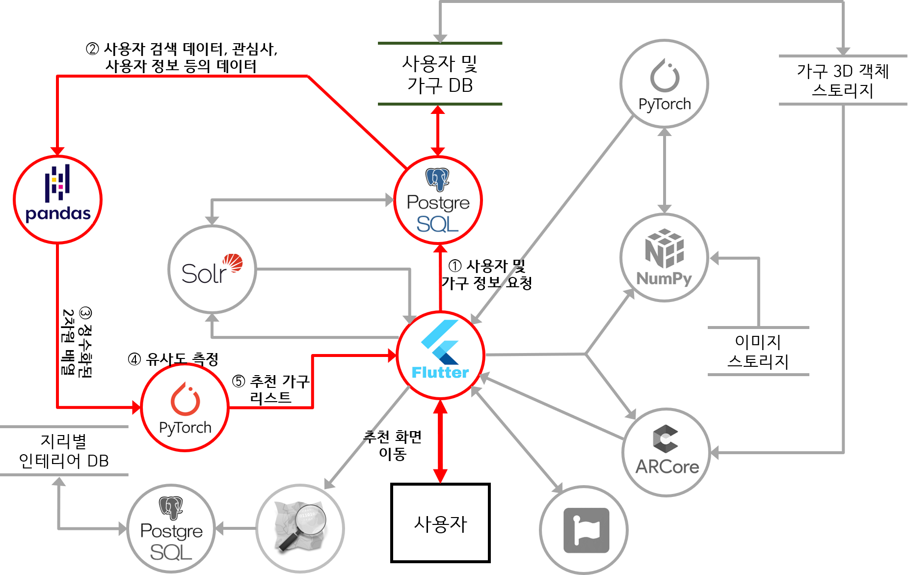
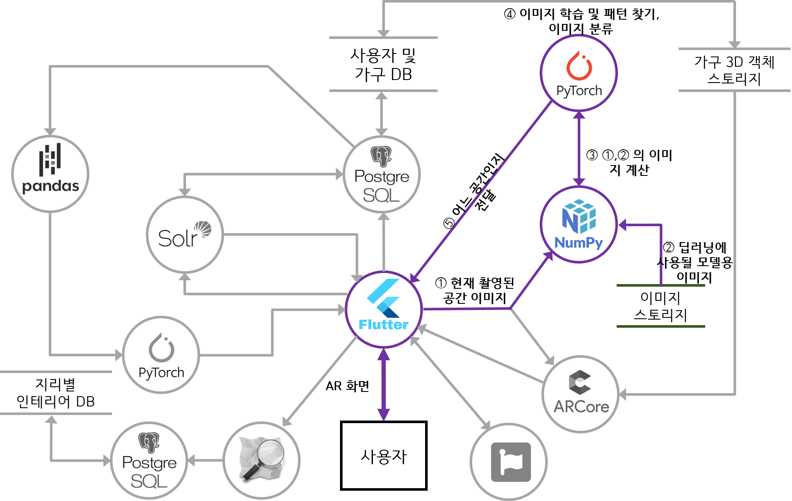

# OS Final Report

Date Created: November 21, 2022 4:21 PM
Status: 진행 중

# 오픈소스 최종 보고서

# 4. 데이터 구조

### 4.1. 데이터베이스

* 사용자 및 가구 데이터베이스 - 사용자 및 가구의 정보를 저장하기 위한 데이터베이스로 가구의 상세 정보만 표시하는것 뿐만 아니라 사용자 추천에도 필요한 정보를 제공

  

  * 사용자 테이블
    * 사용자의 기본 정보가 담긴 테이블로 나이, 성별, 지역 등의 정보가 저장
  * 키워드 테이블
    * 가구에 대한 키워드 정보를 저장한 테이블
    * 타입 : 이 키워드가 무엇을 나타내는 것인지 저장하는 컬럼으로 재질, 색상, 장소, 분류 등이 있음
    * 이름 : 타입에 맞는 특성을 저장하는 컬럼으로 예를들어 유리, 베이지, 욕실, 침대 등이 있음
  * 가구 테이블
    * 가구의 기본 정보가 담긴 테이블로 이름, 사용자 평점, 업체, 이미지 경로, 3D 파일 경로 등이 저장됨
    * 이미지 및 3D파일은 스토리지의 경로를 참조하여 사용
  * 검색 테이블
    * 사용자가 키워드를 검색한다는 의미에서 생겨난 관계집합으로 다대다 관계
    * 사용자가 특정 키워드에 대한 검색한 정보를 저장하는 테이블로 최근 검색일과 검색 횟수가 저장됨
    * 사용자 추천 데이터로 제공
  * 특징 테이블
    * 가구가 특정 키워드에 해당하는 특징을 가진다는 의미에서 생겨난 관계집합으로 다대다 관계
    * 하나의 가구는 여러개의 특징을 가짐 : 베이지색 목재 침대, 검정색 가죽 소파 등
    * 정확도 :  해당 키워드가 가구에게 얼마나 적합한지 나타내는 컬럼
  * 구매 및 좋아요 테이블
    * 사용자가 구매했거나 좋아요한 가구의 관계가 저장

* 지리별 인테리어 데이터베이스 - 사용자의 위치와 지리별 인테리어를 저장하기 위한 데이터베이스로 사용자 위치를 기반으로 하여 해당 위치의 인근 인테리어 정보들을 제공

  
### 4.2. 그 외 스토리지

* 이미지 스토리지 : 가구의 사진 및 공간 분류를 위한 딥러닝에 사용될 모델학습용 이미지가 저장됨
* 3D 오브젝트 스토리지 : AR에서 사용할 가구의 3D 모델링 객체가 저장됨

# 5. DFD 흐름 및 구조

### 전체 흐름

### 5.1. 검색어 저장 및 자동완성

* 기능 활용도
  * 사용자가 검색을 할 때 자동완성 및 오타교정 등의 기능을 제공해 편의성이 증가합니다.
  * 사용자가 검색만으로도 관심이 있다는 것으로 생각해 사용자 추천에 활용이 될 계획입니다.
* 진행 Flow
  * 사용자가 검색을 하면 검색한 단어 및 키워드를 데이터베이스에 저장하고 사용자가 검색한 단어에 관련된 가구를 데이터베이스에서 찾습니다.
  * Solr가 데이터베이스에서 받은 가구 목록을 토대로 자동완성 및 오타교정이 된 단어 리스트를 Flutter를 통해 사용자에게 보여줍니다.

    
### 5.2. 사용자 추천

* 기능 활용도
  * 사용자의 취향에 맞는 가구가 무엇이 있는지 어떤 가구를 좋아할 것 같은지 예상해서 가구 리스트를 보여줌으로써 가구의 판매를 촉진시킵니다.
  * 직접 찾아볼 필요 없이 사용자 취향의 가구를 한 화면에 소개시켜 주기 때문에 사용자의 편의성도 증가합니다.
* 진행 Flow
  * 사용자 추천에 사용될 데이터를 데이터베이스로 부터 얻습니다.
  * 사용될 데이터
    * 가구 정보 (유사도 측정 대상)
    * 컨텐츠 기반 필터링
      * 사용자의 성별, 나이 등의 사용자 정보
      * 사용자가 좋아요 표시를 한 가구들의 정보
      * 사용자가 최근에 검색했거나 자주 검색한 가구 혹은 단어(목재, 블랙, 거실 등)의 정보
    * 협업 필터링
      * 다른 사용자의 정보 및 다른 사용자 취향의 가구들의 정보
  * 이 데이터베이스의 데이터들을 Pandas를 통해 읽어들이고 2차원 배열로 저장하고 배열의 데이터들을 모두 정수 형태로 변환합니다.
  * PyTorch에서 데이터베이스의 정보가 담긴 2차원 배열을 이용하여 유사도가 높은 가구 여러개를 추출하여 Flutter를 통해 사용자에게 보여줍니다.
  
  
### 5.3. 공간 분류

* 기능 활용도
  * 현재 공간을 촬영해 어떤 공간인지 분석하고 어울리는 가구 리스트를 제공해줘서 가구를 찾아볼 필요 없이  AR을 이용하여 배치할 수 있습니다.
* 진행 Flow
  * 사용자가 현재 공간을 촬영합니다.
  * 현재 촬영된 공간의 이미지와 이미지 스토리지에 저장된 딥러닝에 사용될 모델 학습용 이미지가 Numpy를 이용해 계산됩니다.
  * PyTorch에서 CNN 알고리즘을 사용하여 모델용 이미지들로 학습하고 패턴을 찾아 현재 촬영된 이미지가 어떤 공간을 촬영한 것인지 분류됩니다.
  * 현재 공간이 어떤 공간인지 Flutter에게 전달합니다. 추후 AR에서 사용됩니다.

### 5.4. 3D 모델링 객체 불러와서 인테리어 배치

ARCore, MAXST

- 기능 활용도
    - 사용자가 필요한 가구를 구매하려고 할 때 그 크기가 가격으로 인한 부담 때문에 구매 여보에 대한 확신이 들지 않을 때, 혹은 인터리어 적으로 어울릴지에 대한 확신이 들지 않을 때나 집 안에 장소 구조를 고려하여 배치 하는게 부담이 될 때 해당 기능이 도움이 될 것이라 예상됩니다. 
- 선정 이유
    - AR 오픈소스 중 많이 알려진 오픈소스이고 Android뿐만 아니라 ios도 지원하기 때문에 선정하게 되었습니다.
- 진행 Flow1
    - 사용자가 관심을 가지고 있는 가구 혹은 PyTorch에서 제시한 장소에 따른 추천 가구 등을 “사용자 및 가구 DB”에 저장합니다.
    - 가구 정보가 들어있는 database를 토대로 해당 가구들을 3D 모델링화 시켜서  “가구 3D 객체 스토리지”에 저장합니다.
    - 저장되어있는 3D 객체 가구를 불러와서 ARCore를 통해 사용자가 원하는 위치에 배치해보면서 인테리어 시뮬레이션을 진행합니다.
        - ARCore는 모션추적, 환경인식, 조명추정의 3가지 주요 기능을 사용하여 스마트폰의 카메라를 통해 가상 현
        실을 실제 세계와 통합하여 AR을 구현합니다.
- 진행 Flow2
    - 사용자가 가구를 배치하려고 휴대폰으로 공간을 촬영하기 시작합니다.
    - 배치하고자하는 가구를 저장되어있는 3D 객체 가구에서 불러와서 ARCore를 통해 사용자가 원하는 위치에 배치해보면서 인테리어 시뮬레이션을 진행합니다.

- 추가 기능
    - 해당 기능은 오픈소스를 이용해서 구현 할 기능이 아니기 때문에 별도의 기능으로 빼서 추가로 넣었습니다.
    - 오늘의 집에서 어토스케치 업체와 협업하여 3D인테리어 기능을 제공해주는 방식과 마찬가지로 MAXST에서 제공하고 있는 여러 증강현실 기능 중 현실에 있는 물체를 즉시 3D모델링 시켜서 증강현실 속 물체로 반영시켜주는 기능을 활용하여 제공해주고자 합니다.
    - 기능 활용도
        - 사용자가 가지고 있는 가구를 재배치하고자 할 때 가구 배치에 대한 고민을 덜어줄 수 있는 부분에서 해당 기능이 유용하게 쓰일거라 예상합니다.
    - 진행 Flow
        - 사용자가 가지고 있는 가구를 휴대폰으로 촬영하기 시작합니다.
        - 촬영되고 있는 이미지 객체를 MAXST에서 제공해주는 기능을 활용하여 즉시 가구 3D 모델링 제작을 시작합니다.
        - 모델링 된 가구를 현실과 합성하여 가구 재배치할 수 있습니다.

### 5.5. 사용자 위치 정보를 바탕으로 인근 사용자들의 인테리어 탐색

OSM

- 기능 활용도
    - 사용자 위치 정보를 바탕으로 인근에 거주중인 다른 사용자들의 인테리어를 참고하고자 할 때 혹은 비슷한 집 구조에서의 인테리어를 참고하고자 할 때 유용하게 쓰일것이라 예상합니다.
    - 지도 내 실내 인테리어를 직접 띄워주는 것이 아닌 인근에 비슷한 집 구조를 가진 인테리어가 어느정도 있는지, 사용자는 어느정도 있는지를 파악하고 지도에 해당 인테리어를 볼 수 있도록 이동할 수 있는 url정보를 아이콘 형태로 띄우는 정도로 해당 오픈소스를 활용할 예정입니다.

- 선정 이유
    - 상용화된 구글이나 카카오 API 등 더 좋은 기능을 제공할 수 있는 구현 방법이 있지만 오픈 소스만을 이용하여 해당 프로젝트를 완성시키고자 하였습니다.
    - 저장한 database를 바탕으로 누구나 자유롭게 편집 가능한 무료배포 서비스인 OSM이 본 프로젝트 서비스와 어울린다고 판단하였습니다.
    - 다양한 OpenGL 3D Graphics Library 와 결합이 가능해서 3D 지도 제작 기능을 쉽게 넣을 수 있습니다.
- 진행 Flow1
    - 지리별로 인테리어 정보들을 database에 저장합니다.
    - 사용자가 본인이 관심있는 지역의 인근 인테리어 정보들을 알아보고자 OSM에 접속하여 검색을 요청합니다.
    - OSM에서 사용자의 검색으로 들어온 지역의 인근 인테리어 정보를 “지리별 인테리어 DB”에서 탐색하여 응답을 보냅니다.
    

### 5.6.UI 아이콘 제작

Font-Awesome

- 기능 활용도
    - 사용자가 보기 쉽게 프론트 UI 작업에 필요한 아이콘을 다체롭게 제공하는데 쓰일 예정입니다.

- 선정 이유
    - 웹에서 아이콘이 필요할 때 가장 많이 사용되는 라이브러리이고 Solid, Regular, Light 등 하나의 아이콘에 다양한 변형 버전 제공 및 사이즈 변경이 가능하기 때문에 원하는데로 수정이 가능합니다.
